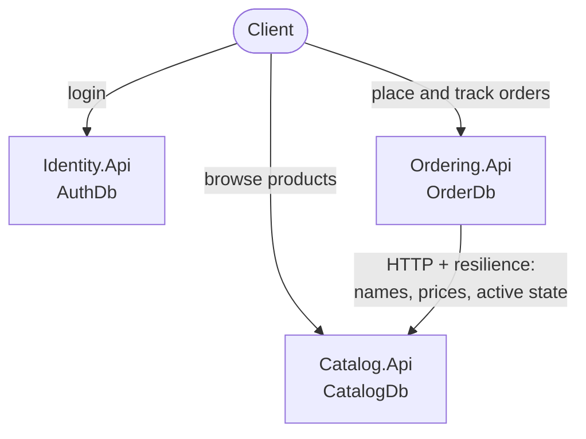
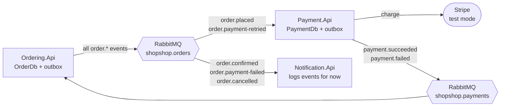
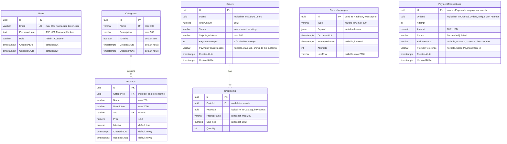
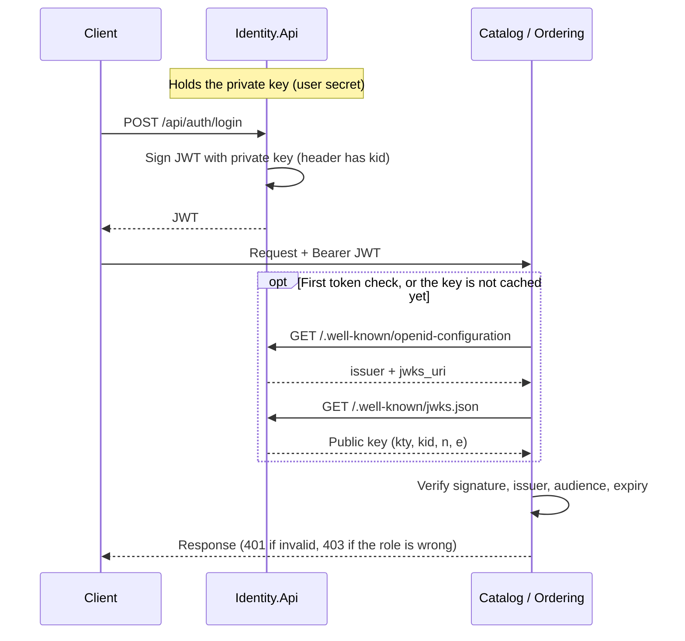
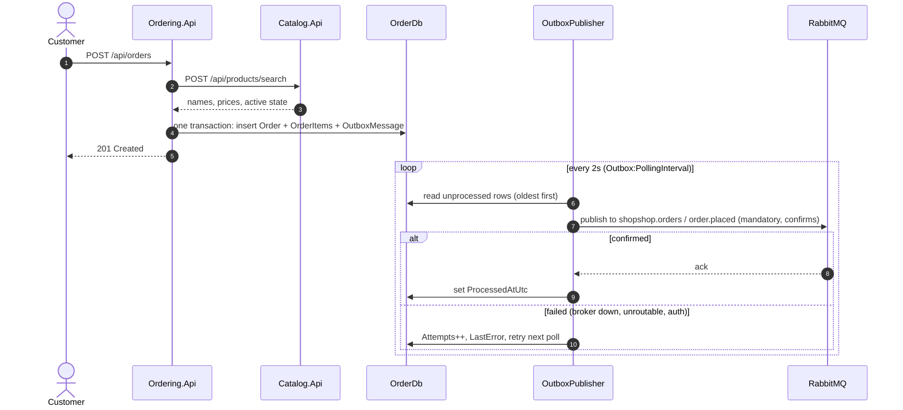
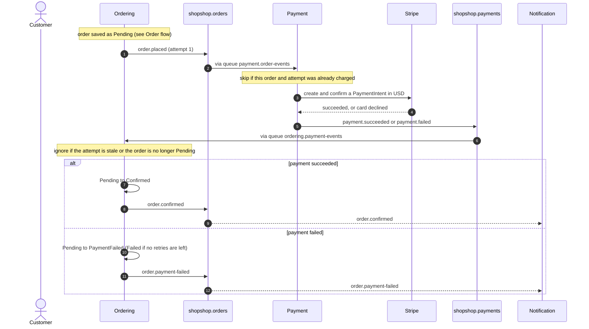
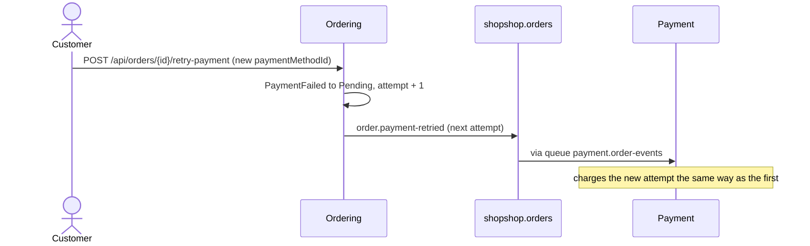
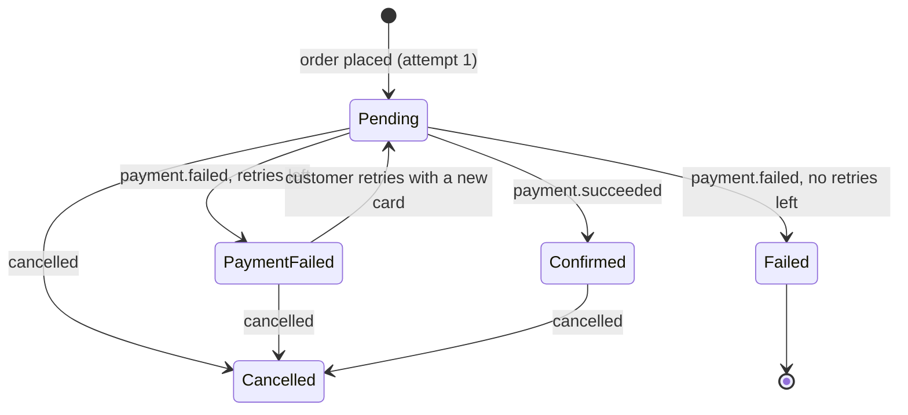

# ShopShop Architecture

How ShopShop is put together and where to find things in the code. For setup see the [readme](../readme.md), and for details see the [API reference](api.md), [configuration](configuration.md) and [messaging](messaging.md).

## Contents

- [Project structure](#project-structure)
- [Architecture overview](#architecture-overview)
- [Database diagram](#database-diagram)
- [Authentication flow](#authentication-flow)
- [Order flow](#order-flow)
- [Payment flow](#payment-flow)
- [Key concepts](#key-concepts)

## Project structure

```text
ShopShop/
├── src/
│   ├── BuildingBlocks/
│   │   ├── BuildingBlocks.Core         # Result<T>, ResultErrorType, Roles
│   │   ├── BuildingBlocks.Web          # EndpointResults.ToHttpResult
│   │   ├── BuildingBlocks.Contracts    # integration events + routing keys (Orders/, Payments/)
│   │   └── BuildingBlocks.Messaging    # RabbitMQ connection, publisher, consumer base, topology
│   └── Services/
│       ├── Identity/
│       │   ├── Identity.Api
│       │   └── Identity.Infrastructure
│       ├── Catalog/
│       │   ├── Catalog.Api
│       │   └── Catalog.Infrastructure
│       ├── Ordering/
│       │   ├── Ordering.Api
│       │   └── Ordering.Infrastructure
│       ├── Payment/
│       │   ├── Payment.Api
│       │   └── Payment.Infrastructure
│       └── Notification/
│           └── Notification.Api
├── tests/
│   └── Services/
│       ├── Identity/Identity.Api.UnitTests
│       ├── Catalog/Catalog.Api.UnitTests
│       ├── Ordering/Ordering.Api.UnitTests
│       ├── Payment/Payment.Api.UnitTests
│       └── Notification/Notification.Api.UnitTests
├── docs/
├── docker-compose.yml
├── init-dbs.sql
└── ShopShop.slnx
```

Each service has two projects:

| Project | Holds |
|---|---|
| `<Svc>.Api` | Endpoints, DTOs, business services, validators, filters, options, extensions and `Program.cs` |
| `<Svc>.Infrastructure` | The DbContext, entities, Fluent configurations, migrations and constants |

```text
Ordering.Api/                     Ordering.Infrastructure/
├── DTOs/                         ├── Configurations/
├── Endpoints/                    ├── Constants/
├── Extensions/                   ├── Data/
├── Filters/                      ├── Migrations/
├── Messaging/                    └── Models/
├── Options/
├── Services/
├── Validators/
└── Program.cs
```

Differences from that shape:

- **Identity.Api** adds `Security/` (`IJwtKeyProvider`, `JwtKeyProvider`) for the signing key and the public JWKS.
- **Payment.Api** has no `Endpoints/`. It has `Messaging/` (`OutboxPublisher`, `OrderEventsConsumer`) instead.
- **Notification.Api** has no Infrastructure project, because it stores nothing yet. It has `Messaging/` (`OrderEventsConsumer`), `Services/` (`NotificationService`) and `Program.cs`.

## Architecture overview

Two small diagrams: how requests flow, and how events flow.

### Requests (HTTP)



- Clients send a Bearer JWT to Catalog and Ordering. The services check it themselves (see [Authentication flow](#authentication-flow)).
- HTTP is used when the caller needs an answer now. Ordering asks Catalog before it creates an order.
- Each service owns its database. No service reads another one's.

### Events (RabbitMQ)



- Events are used when other services only need to react. Ordering and Payment never call each other.
- Every event leaves a service through its outbox, so it is sent only if the change that caused it was saved.

## Database diagram

Each service owns its own database. Lines are real foreign keys *inside* one database.



| Database | Tables | Owner |
|---|---|---|
| `AuthDb` | `Users` | Identity |
| `CatalogDb` | `Categories`, `Products` | Catalog |
| `OrderDb` | `Orders`, `OrderItems`, `OutboxMessages` | Ordering |
| `PaymentDb` | `PaymentTransactions`, `OutboxMessages` | Payment |

- `Orders.UserId`, `OrderItems.ProductId` and `PaymentTransactions.OrderId` point into **other databases**, so they are plain ids with no foreign key. The owning service keeps them consistent.
- `OrderItems.ProductName` and `UnitPrice` are **snapshots**: later catalog changes don't rewrite past orders. `TotalPrice` is computed in code and not stored.
- `Orders.Status` values: `Pending`, `Confirmed`, `Processing`, `Shipped`, `Delivered`, `Cancelled`, `Refunded`, `Failed`, `PaymentFailed`.
- `PaymentTransactions` has a unique index on (`OrderId`, `Attempt`), so each attempt is charged at most once.
- `ProcessedAtUtc` is indexed on both `OutboxMessages` tables, because the publishers read pending rows (`ProcessedAtUtc IS NULL`).

## Authentication flow

Tokens are signed with an RSA key pair (RS256). Only Identity holds the private key, and everyone else verifies with the public key.



- **Private key:** in Identity's user secrets. `IJwtKeyProvider` loads it once and exposes the signing key and the public JWKS.
- **Public key:** Catalog and Ordering only configure `MetadataAddress`. JwtBearer fetches the key on the first token check and caches it.
- **Identity down:** other services still start. Token checks return 401 until Identity is reachable again, then recover on their own.
- **`kid`:** every token names its signing key, which leaves room for key rotation.

## Order flow

How an order is saved and its event published.



- The order and its event are saved in **one transaction**, so an event is never lost and never sent for an order that wasn't saved.
- Delivery is **at least once**, so consumers must be idempotent by `MessageId` (the outbox row id).
- Prices always come from Catalog, never from the client.

## Payment flow

What happens after `order.placed` is published. Payment never calls Ordering, and Ordering never calls Payment.



### Retrying a failed payment



### Order status while waiting for payment



- **Retries:** `Payment:MaxRetries` in Ordering's config (default 3) sets how many retries follow the first attempt. The attempt number travels on every event.
- **Failure reasons:** Stripe's card decline messages are shown to the customer as they are. Provider errors get a generic message, and the details are only logged.
- **Stale results:** a result for an older attempt, a redelivered result, or a result for an order cancelled while paying changes nothing. Refunds are not implemented.
- **Notification:** reacts to Ordering's `order.confirmed`, `order.payment-failed` and `order.cancelled` rather than Payment's events, so it only announces what Ordering actually did. It must have started once so its queue exists (see [messaging](messaging.md#start-every-consumer-at-least-once)).

## Key concepts

Where each idea lives in the code.

### Data and structure

| Concept | How it's done here | Where to look |
|---|---|---|
| Database per service | Each service has its own PostgreSQL database and DbContext. | `*.Infrastructure/Data/` |
| Pragmatic layering | Two projects per service instead of full Clean Architecture. No repositories, MediatR or mappers. | `src/Services/<Svc>/` |
| EF Core mapping | Fluent `IEntityTypeConfiguration<T>` classes, explicit table names, `numeric(18,2)` money, enums as strings. Migrations apply on startup in Development. | `*.Infrastructure/Configurations/` |
| Data snapshots | Order items copy the product name and price at order time. | `OrderItem.ProductName` / `UnitPrice` |

### API and code style

| Concept | How it's done here | Where to look |
|---|---|---|
| Minimal APIs | Endpoints are grouped with `MapGroup` and named with `.WithName`. Admin routes live in separate `Admin*Endpoints` classes. | `*.Api/Endpoints/` |
| Search as `POST` | List endpoints are `POST …/search` with a `<Entity>Query` body. A bare `POST` is always a create. | `ProductEndpoints`, `OrderEndpoints` |
| Result pattern | Business failures return `Result<T>` with a `ResultErrorType`. `EndpointResults.ToHttpResult` maps them to status codes. | `BuildingBlocks.Core`, `BuildingBlocks.Web` |
| Validation | FluentValidation validators run through a generic `ValidationFilter<T>`. | `*.Api/Validators/`, `*.Api/Filters/` |
| Error handling | `UseExceptionHandler` logs unexpected exceptions and returns a generic 500. | each `Program.cs` |
| Logging | Serilog message templates to the console and CLEF files, plus request logging. | each `Program.cs` |
| Fail-fast configuration | Options and connection strings are checked at startup. Secrets live in user secrets. | `*.Api/Options/` |

### Security

| Concept | How it's done here | Where to look |
|---|---|---|
| Authentication | RS256 JWTs signed by Identity and verified with its public key. See [Authentication flow](#authentication-flow). | `Identity.Api/Security/`, `JwksEndpoints.cs` |
| Authorization | `Admin` and `Customer` roles come from one shared `Roles` class. | `BuildingBlocks.Core/Roles.cs` |
| Card data | Clients send only a Stripe payment method id (`pm_...`). Card numbers never reach our services. | `PaymentMethodIdRules`, `StripePaymentService` |

### Service communication

| Concept | How it's done here | Where to look |
|---|---|---|
| Resilient HTTP | Ordering calls Catalog through a typed `HttpClient` with `AddStandardResilienceHandler()`. Transport failures become 503. | `CatalogServiceClient.cs` |
| Transactional outbox | Events are saved as `OutboxMessage` rows in the same `SaveChangesAsync` as the change, then published by a background service. | `OrderingService.AddOutboxMessage`, `OutboxPublisher.cs` |
| Reliable publishing | Publisher confirms and `mandatory: true`. Failed rows keep `Attempts` and `LastError` and retry on the next poll. | `RabbitMqPublisher.cs` |
| Topology | Two topic exchanges, one durable queue per consumer, dead-lettering to `<queue>.dead`. See [messaging](messaging.md). | `MessagingTopology.cs`, `RoutingKeys.cs` |
| Choreography | No central coordinator. Each service reacts to events and publishes its own. | `*.Api/Messaging/*Consumer.cs` |
| Idempotent consumers | One `PaymentTransaction` per order and attempt, a Stripe idempotency key per attempt, and Ordering ignores stale results. | `PaymentProcessingService`, `OrderingService.IsCurrentPendingAttempt` |
| Event contracts | Versionable `sealed record`s in a shared library, serialised as camelCase JSON. | `BuildingBlocks.Contracts/` |

### Testing

| Concept | How it's done here | Where to look |
|---|---|---|
| Unit tests | xUnit, Moq and the EF Core InMemory provider. Background work is a public method (`PublishPendingAsync`) so it needs no timers. | `tests/Services/` |
