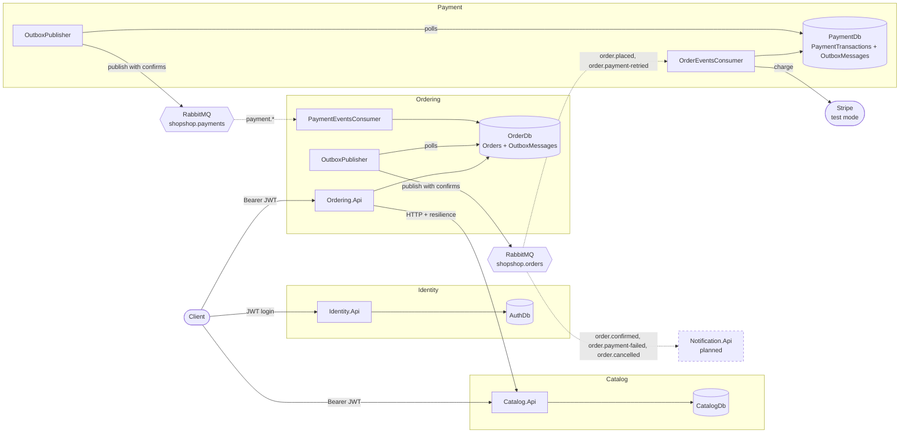
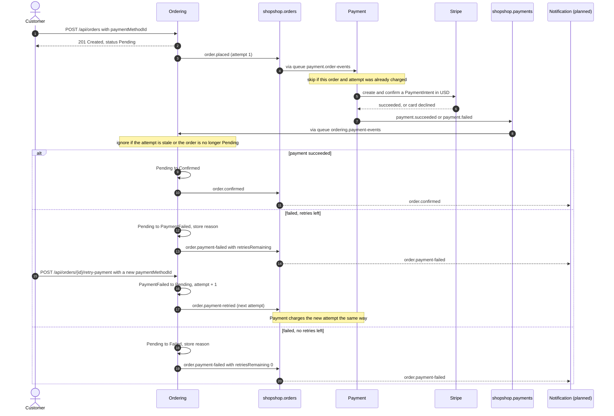
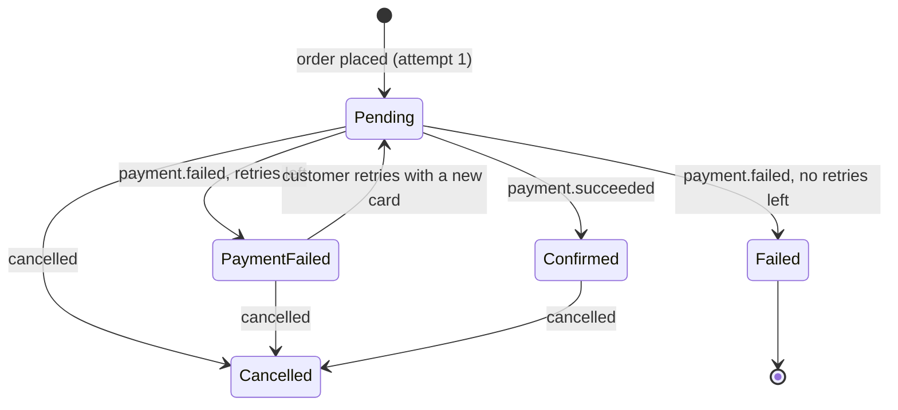
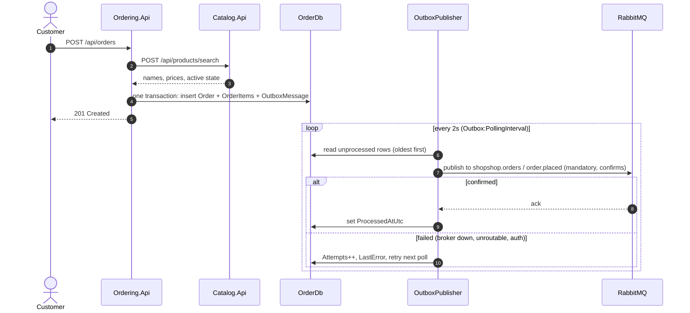
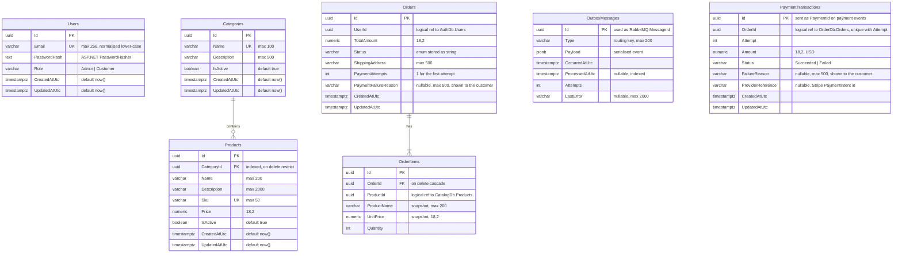

# ShopShop Architecture

This page covers which concepts are used in ShopShop and where to find them in the code. For setup and endpoints, see the [readme](../readme.md).

## Contents

- [Key concepts](#key-concepts)
- [Architecture](#architecture)
- [Payment flow](#payment-flow)
- [Order event flow](#order-event-flow)
- [Database diagram](#database-diagram)
- [Project structure](#project-structure)

## Key concepts

| Concept | How it's done here | Where to look |
|---|---|---|
| Database per service | Each service has its own PostgreSQL database and DbContext. No service reads another service's database. | `*.Infrastructure/Data/` |
| Pragmatic layering | Two projects per service (`Api` + `Infrastructure`) instead of full Clean Architecture. No repositories, MediatR or mappers. | `src/Services/<Svc>/` |
| Minimal APIs | Endpoints are grouped per area with `MapGroup`, named with `.WithName`, and admin routes live in separate `Admin*Endpoints` classes. | `*.Api/Endpoints/` |
| Search as `POST` | List endpoints are `POST …/search` with a `<Entity>Query` record body, and a bare `POST` is always a create. | `ProductEndpoints`, `OrderEndpoints` |
| Result pattern | Business failures return `Result<T>` with a `ResultErrorType` instead of throwing, and `EndpointResults.ToHttpResult` maps them to HTTP status codes. | `src/BuildingBlocks/BuildingBlocks.Core`, `BuildingBlocks.Web` |
| Validation | FluentValidation validators run through a generic `ValidationFilter<T>` endpoint filter. | `*.Api/Validators/`, `*.Api/Filters/` |
| Authentication across services | Identity issues HS256 JWTs. Catalog and Ordering validate them locally with the shared `JwtSettings`, with no call back to Identity. Payment has no public API. | `Identity.Api/Services/AuthService.cs`, each `Program.cs` |
| Role-based authorization | `Admin` and `Customer` roles come from one shared `Roles` class. Admin groups use `RequireRole(Roles.Admin)`. | `BuildingBlocks.Core/Roles.cs` |
| Resilient service-to-service HTTP | Ordering calls Catalog through a typed `HttpClient` with `AddStandardResilienceHandler()`. Transport failures become `ServiceUnavailable`, which maps to 503. | `Ordering.Api/Services/CatalogServiceClient.cs` |
| Data snapshots | Order items copy the product name and price at order time, so orders don't depend on the catalog later. Prices always come from Catalog, never from the client. | `OrderItem.ProductName` / `UnitPrice` |
| Transactional outbox | Ordering and Payment save events as `OutboxMessage` rows in the same `SaveChangesAsync` as the change they describe. A background service in each publishes them afterwards. | `OrderingService.AddOutboxMessage`, `PaymentProcessingService`, `*.Api/Messaging/OutboxPublisher.cs` |
| Reliable publishing | Publisher confirms and `mandatory: true` make unroutable or unconfirmed messages fail. Failed rows keep `Attempts` and `LastError` and are retried on the next poll. | `BuildingBlocks.Messaging/RabbitMqPublisher.cs` |
| Messaging topology | Topic exchanges `shopshop.orders` (`order.placed`, `order.payment-retried`, `order.confirmed`, `order.payment-failed`, `order.cancelled`) and `shopshop.payments` (`payment.succeeded`, `payment.failed`). Each consumer gets one durable queue, which dead-letters to `<queue>.dead` through `shopshop.dlx`. | `MessagingTopology.cs`, `RoutingKeys.cs`, `PaymentRoutingKeys.cs`, `RabbitMqConsumer.cs` |
| Choreography | No central coordinator: each service reacts to events and publishes its own. Payment never calls Ordering, and Ordering never calls Payment. | `*.Api/Messaging/*Consumer.cs` |
| Idempotent consumers | Payment stores one `PaymentTransaction` per order and attempt (unique index) and sends Stripe an idempotency key per attempt, so a redelivered message never charges twice. Ordering ignores results for an older attempt or for an order that is no longer `Pending`. | `PaymentProcessingService`, `StripePaymentService`, `OrderingService.IsCurrentPendingAttempt` |
| Card data stays with Stripe | Clients send only a Stripe payment method id (`pm_...`), validated in Ordering. Card numbers never reach our services. | `PaymentMethodIdRules`, `StripePaymentService` |
| Integration event contracts | Events are versionable `sealed record`s in a shared contracts library, serialised as camelCase JSON. | `BuildingBlocks.Contracts/Orders/`, `BuildingBlocks.Contracts/Payments/` |
| Structured logging | Serilog with message templates, writing to the console and to CLEF files in `logs/`, plus request logging. | each `Program.cs`, `appsettings.json` |
| Centralised error handling | `UseExceptionHandler` logs unexpected exceptions and returns a generic 500 body. | each `Program.cs` |
| Fail-fast configuration | Options and connection strings are checked at startup. Secrets live in user secrets, never in appsettings. | each `Program.cs`, `*.Api/Options/` |
| EF Core mapping | Fluent `IEntityTypeConfiguration<T>` classes (no data annotations), explicit table names, `numeric(18,2)` money, enums stored as strings. Migrations are applied on startup in Development. | `*.Infrastructure/Configurations/`, `Migrations/` |
| Unit testing | xUnit + Moq with the EF Core InMemory provider. Background-service work is exposed as a public method (`PublishPendingAsync`) so it can be tested without timers. | `tests/Services/` |

## Architecture



- **Synchronous (HTTP):** used when the caller needs an answer now. Ordering asks Catalog for product names, prices and active state before creating an order.
- **Asynchronous (events):** used when other services only need to react. Ordering and Payment talk to each other only through events.
- Services never access another service's database.

## Payment flow

What happens once an order is placed. Every arrow into or out of RabbitMQ goes through the sender's outbox, so an event is only sent if the change that caused it was saved.



The order status while it waits for payment:



- **Retries:** `Payment:MaxRetries` in Ordering's config (default 3) sets how many retries follow the first attempt. Each attempt has its own number, which travels on every event.
- **Failure reasons:** Stripe's card decline messages are written for customers and are shown as they are. Provider errors get a generic message, and the details are only logged.
- **Stale results:** a result for an older attempt, a redelivered result, or a result for an order cancelled while paying changes nothing. Refunds are not implemented.
- **Notification:** consumes `order.confirmed`, `order.payment-failed` and `order.cancelled` from Ordering rather than Payment's events, so it only announces what Ordering actually did. Until it exists, a debug queue must be bound to these keys, or the unroutable events block Ordering's outbox (see the [readme](../readme.md#5-events-nobody-consumes-yet)).

## Order event flow



Because the order and its event are saved in one transaction, an event is never lost and never sent for an order that wasn't saved. Delivery is **at least once**, so consumers must be idempotent by `MessageId` (the outbox row id).

## Database diagram

Each service owns its own database. Relationships drawn with lines are real foreign keys *inside* one database.



| Database | Tables | Owner |
|---|---|---|
| `AuthDb` | `Users` | Identity |
| `CatalogDb` | `Categories`, `Products` | Catalog |
| `OrderDb` | `Orders`, `OrderItems`, `OutboxMessages` | Ordering |
| `PaymentDb` | `PaymentTransactions`, `OutboxMessages` | Payment |

Notes:

- `Orders.UserId`, `OrderItems.ProductId` and `PaymentTransactions.OrderId` point to data in **other databases**, so they are plain ids with no foreign key. Consistency is handled by the owning service, not by the database.
- `OrderItems.ProductName` and `UnitPrice` are **snapshots**: later catalog changes don't rewrite past orders. `TotalPrice` is computed in code and not stored.
- `Orders.Status` values: `Pending`, `Confirmed`, `Processing`, `Shipped`, `Delivered`, `Cancelled`, `Refunded`, `Failed`, `PaymentFailed`.
- `PaymentTransactions` has a unique index on (`OrderId`, `Attempt`), so each attempt is charged at most once.
- `PaymentDb.OutboxMessages` has the same shape as Ordering's. `OutboxMessages.ProcessedAtUtc` is indexed in both because the publishers read pending rows (`ProcessedAtUtc IS NULL`).

## Project structure

```text
ShopShop/
├── src/
│   ├── BuildingBlocks/
│   │   ├── BuildingBlocks.Core         # Result<T>, ResultErrorType, Roles
│   │   ├── BuildingBlocks.Web          # EndpointResults.ToHttpResult
│   │   ├── BuildingBlocks.Contracts    # integration events + routing keys (Orders/, Payments/)
│   │   └── BuildingBlocks.Messaging    # RabbitMQ connection, publisher, consumer base, topology
│   └── Services/
│       ├── Identity/
│       │   ├── Identity.Api
│       │   └── Identity.Infrastructure
│       ├── Catalog/
│       │   ├── Catalog.Api
│       │   └── Catalog.Infrastructure
│       ├── Ordering/
│       │   ├── Ordering.Api
│       │   └── Ordering.Infrastructure
│       └── Payment/
│           ├── Payment.Api
│           └── Payment.Infrastructure
├── tests/
│   └── Services/
│       ├── Identity/Identity.Api.UnitTests
│       ├── Catalog/Catalog.Api.UnitTests
│       ├── Ordering/Ordering.Api.UnitTests
│       └── Payment/Payment.Api.UnitTests
├── docker-compose.yml
├── init-dbs.sql
└── ShopShop.slnx
```

### Api projects

Endpoints, DTOs, business services, validators, filters, options, extensions and `Program.cs`.

```text
Ordering.Api/
├── DTOs/
├── Endpoints/
├── Extensions/
├── Filters/
├── Messaging/        # OutboxPublisher, PaymentEventsConsumer
├── Options/
├── Services/
├── Validators/
└── Program.cs
```

Payment.Api has no endpoints: just `DTOs/`, `Messaging/` (`OutboxPublisher`, `OrderEventsConsumer`), `Options/`, `Services/` and `Program.cs`.

### Infrastructure projects

The EF Core DbContext, entities, Fluent configurations, migrations and constants.

```text
Ordering.Infrastructure/
├── Configurations/
├── Constants/
├── Data/
├── Migrations/
└── Models/
```

