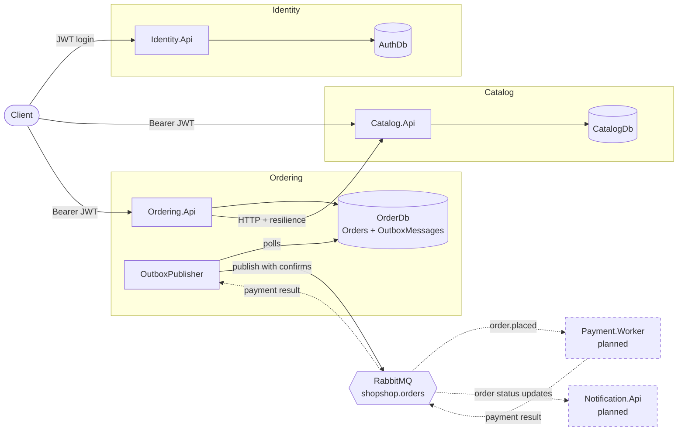
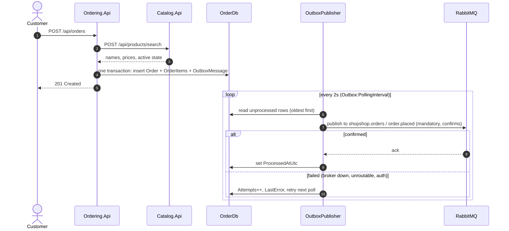
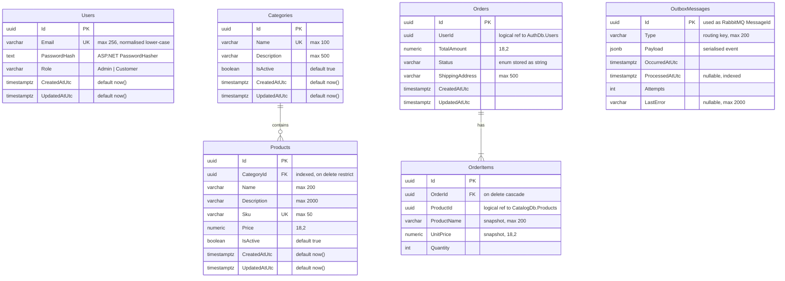

# ShopShop Architecture

This page covers which concepts are used in ShopShop and where to find them in the code. For setup and endpoints, see the [readme](../readme.md).

## Contents

- [Key concepts](#key-concepts)
- [Architecture](#architecture)
- [Order event flow](#order-event-flow)
- [Database diagram](#database-diagram)
- [Project structure](#project-structure)

## Key concepts

| Concept | How it's done here | Where to look |
|---|---|---|
| Database per service | Each service has its own PostgreSQL database and DbContext. No service reads another service's database. | `*.Infrastructure/Data/` |
| Pragmatic layering | Two projects per service (`Api` + `Infrastructure`) instead of full Clean Architecture. No repositories, MediatR or mappers. | `src/Services/<Svc>/` |
| Minimal APIs | Endpoints are grouped per area with `MapGroup`, named with `.WithName`, and admin routes live in separate `Admin*Endpoints` classes. | `*.Api/Endpoints/` |
| Search as `POST` | List endpoints are `POST …/search` with a `<Entity>Query` record body, and a bare `POST` is always a create. | `ProductEndpoints`, `OrderEndpoints` |
| Result pattern | Business failures return `Result<T>` with a `ResultErrorType` instead of throwing, and `EndpointResults.ToHttpResult` maps them to HTTP status codes. | `src/BuildingBlocks/BuildingBlocks.Core`, `BuildingBlocks.Web` |
| Validation | FluentValidation validators run through a generic `ValidationFilter<T>` endpoint filter. | `*.Api/Validators/`, `*.Api/Filters/` |
| Authentication across services | Identity issues HS256 JWTs. Catalog and Ordering validate them locally with the shared `JwtSettings`, with no call back to Identity. | `Identity.Api/Services/AuthService.cs`, each `Program.cs` |
| Role-based authorization | `Admin` and `Customer` roles come from one shared `Roles` class. Admin groups use `RequireRole(Roles.Admin)`. | `BuildingBlocks.Core/Roles.cs` |
| Resilient service-to-service HTTP | Ordering calls Catalog through a typed `HttpClient` with `AddStandardResilienceHandler()`. Transport failures become `ServiceUnavailable`, which maps to 503. | `Ordering.Api/Services/CatalogServiceClient.cs` |
| Data snapshots | Order items copy the product name and price at order time, so orders don't depend on the catalog later. Prices always come from Catalog, never from the client. | `OrderItem.ProductName` / `UnitPrice` |
| Transactional outbox | Events are saved as `OutboxMessage` rows in the same `SaveChangesAsync` as the order. A background service publishes them afterwards. | `OrderingService.AddOutboxMessage`, `Ordering.Api/Messaging/OutboxPublisher.cs` |
| Reliable publishing | Publisher confirms and `mandatory: true` make unroutable or unconfirmed messages fail. Failed rows keep `Attempts` and `LastError` and are retried on the next poll. | `BuildingBlocks.Messaging/RabbitMqPublisher.cs` |
| Messaging topology | Topic exchange `shopshop.orders` with routing keys `order.placed` and `order.cancelled`. Each consumer gets one durable queue, which dead-letters to `<queue>.dead` through `shopshop.dlx`. | `MessagingTopology.cs`, `RabbitMqConsumer.cs` |
| Integration event contracts | Events are versionable `sealed record`s in a shared contracts library, serialised as camelCase JSON. | `BuildingBlocks.Contracts/Orders/` |
| Structured logging | Serilog with message templates, writing to the console and to CLEF files in `logs/`, plus request logging. | each `Program.cs`, `appsettings.json` |
| Centralised error handling | `UseExceptionHandler` logs unexpected exceptions and returns a generic 500 body. | each `Program.cs` |
| Fail-fast configuration | Options and connection strings are checked at startup. Secrets live in user secrets, never in appsettings. | each `Program.cs`, `*.Api/Options/` |
| EF Core mapping | Fluent `IEntityTypeConfiguration<T>` classes (no data annotations), explicit table names, `numeric(18,2)` money, enums stored as strings. Migrations are applied on startup in Development. | `*.Infrastructure/Configurations/`, `Migrations/` |
| Unit testing | xUnit + Moq with the EF Core InMemory provider. Background-service work is exposed as a public method (`PublishPendingAsync`) so it can be tested without timers. | `tests/Services/` |

## Architecture



- **Synchronous (HTTP):** used when the caller needs an answer now. Ordering asks Catalog for product names, prices and active state before creating an order.
- **Asynchronous (events):** used when other services only need to react. Ordering publishes `order.placed` and `order.cancelled`.
- Services never access another service's database.

### Planned payment and notification flow

Payment and Notification are not implemented yet. The intended flow is:

1. A customer places an order. Ordering saves it as `Pending` and publishes `order.placed`.
2. Payment.Worker consumes `order.placed` and publishes a success or failure result.
3. Ordering consumes the result and updates the order:
   - **Success:** the order becomes `Confirmed`, and the status update goes to Notification.
   - **Failure:** the order becomes `Failed` with a reason. The customer sees the error on the order itself (`GET /api/orders/{id}`). Nothing goes to Notification.
4. Any other order status update (for example an admin moving an order to `Shipped`) also goes to Notification, which pushes it to the live SignalR page.

So Notification only hears about successful payments and status updates, never about payment failures.

## Order event flow



Because the order and its event are saved in one transaction, an event is never lost and never sent for an order that wasn't saved. Delivery is **at least once**, so consumers must be idempotent by `MessageId` (the outbox row id).

## Database diagram

Each service owns its own database. Relationships drawn with lines are real foreign keys *inside* one database.



| Database | Tables | Owner |
|---|---|---|
| `AuthDb` | `Users` | Identity |
| `CatalogDb` | `Categories`, `Products` | Catalog |
| `OrderDb` | `Orders`, `OrderItems`, `OutboxMessages` | Ordering |

Notes:

- `Orders.UserId` and `OrderItems.ProductId` point to data in **other databases**, so they are plain ids with no foreign key. Consistency is handled by the owning service, not by the database.
- `OrderItems.ProductName` and `UnitPrice` are **snapshots**: later catalog changes don't rewrite past orders. `TotalPrice` is computed in code and not stored.
- `Orders.Status` values: `Pending`, `Confirmed`, `Processing`, `Shipped`, `Delivered`, `Cancelled`, `Refunded`, `Failed`.
- `OutboxMessages.ProcessedAtUtc` is indexed because the publisher reads pending rows (`ProcessedAtUtc IS NULL`).

## Project structure

```text
ShopShop/
├── src/
│   ├── BuildingBlocks/
│   │   ├── BuildingBlocks.Core         # Result<T>, ResultErrorType, Roles
│   │   ├── BuildingBlocks.Web          # EndpointResults.ToHttpResult
│   │   ├── BuildingBlocks.Contracts    # integration events + RoutingKeys
│   │   └── BuildingBlocks.Messaging    # RabbitMQ connection, publisher, consumer base, topology
│   └── Services/
│       ├── Identity/
│       │   ├── Identity.Api
│       │   └── Identity.Infrastructure
│       ├── Catalog/
│       │   ├── Catalog.Api
│       │   └── Catalog.Infrastructure
│       └── Ordering/
│           ├── Ordering.Api
│           └── Ordering.Infrastructure
├── tests/
│   └── Services/
│       ├── Identity/Identity.Api.UnitTests
│       ├── Catalog/Catalog.Api.UnitTests
│       └── Ordering/Ordering.Api.UnitTests
├── docker-compose.yml
├── init-dbs.sql
└── ShopShop.slnx
```

### Api projects

Endpoints, DTOs, business services, validators, filters, options, extensions and `Program.cs`.

```text
Ordering.Api/
├── DTOs/
├── Endpoints/
├── Extensions/
├── Filters/
├── Messaging/        # OutboxPublisher
├── Options/
├── Services/
├── Validators/
└── Program.cs
```

### Infrastructure projects

The EF Core DbContext, entities, Fluent configurations, migrations and constants.

```text
Ordering.Infrastructure/
├── Configurations/
├── Constants/
├── Data/
├── Migrations/
└── Models/
```

