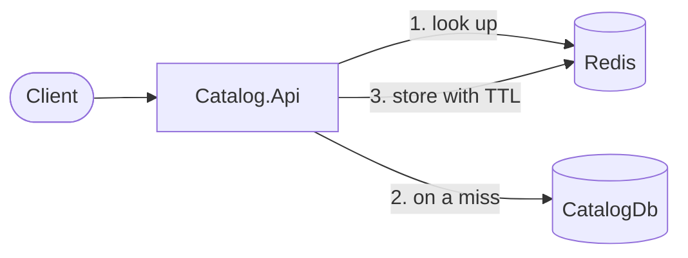

# Caching

Catalog reads are cached in Redis with the cache-aside pattern.

## What is cached

| Endpoint | Key | TTL |
|---|---|---|
| `GET /api/products/{id}` | `catalog:product:{id}` | `Cache:EntityTtlMinutes` (10) |
| `GET /api/categories/{id}` | `catalog:category:{id}` | `Cache:EntityTtlMinutes` (10) |
| `POST /api/products/search` | `catalog:products:search:{version}:{query hash}` | `Cache:SearchTtlMinutes` (2) |
| `POST /api/categories/search` | `catalog:categories:search:{version}:{query hash}` | `Cache:SearchTtlMinutes` (2) |

Not cached: not-found results, Ordering, Identity, Payment, Notification and the Gateway. Their data is per user, changes with events, or must always be fresh. Ordering benefits anyway, because its price lookup goes through Catalog's cached search.

## Invalidation

- Admin create, update and delete remove the entity key (if any) and **bump `catalog:version`**.
- The version is part of every search key, so one bump makes all old search results unreachable. They expire on their own TTL.
- The version is shared by products and categories, so a category write also refreshes product searches.
- Invalidation runs after `SaveChangesAsync()`, never before.

## When Redis is down

`CatalogCache` catches every Redis error, logs a warning and behaves like a cache miss. The API keeps working from PostgreSQL, only slower.

## Where the code is

| What | File |
|---|---|
| Cache wrapper | `Catalog.Api/Caching/CatalogCache.cs` (`ICatalogCache`) |
| Key formats | `Catalog.Api/Caching/CatalogCacheKeys.cs` |
| Settings | `Catalog.Api/Options/CacheOptions.cs` |
| Used by | `ProductService`, `CategoryService` |
