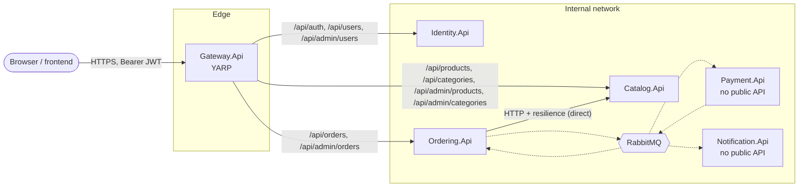
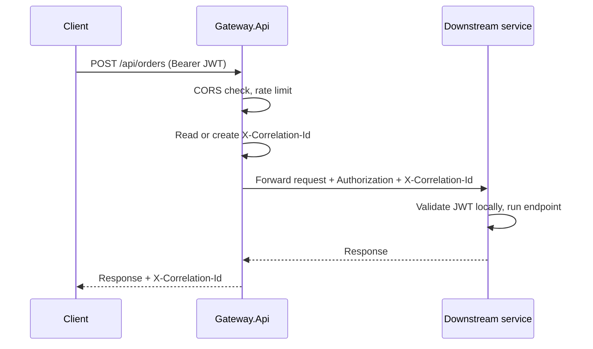
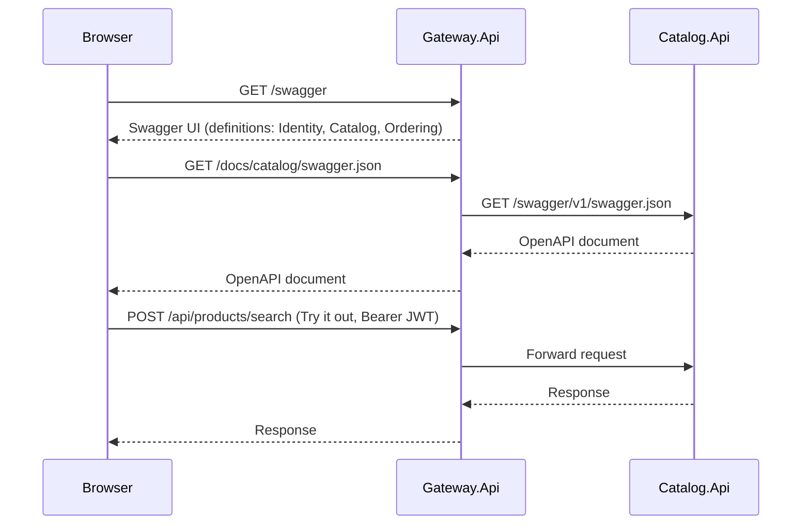

# API Gateway (YARP)

This page describes the edge gateway: why it exists, what it routes, and what it deliberately does not do. For the rest of the system, see [architecture.md](architecture.md).

## Contents

- [Purpose](#purpose)
- [Topology](#topology)
- [Route table](#route-table)
- [Request flow](#request-flow)
- [Responsibilities](#responsibilities)
- [Design decisions](#design-decisions)
- [Combined Swagger](#combined-swagger)
- [Configuration and ports](#configuration-and-ports)

## Purpose

A future frontend should talk to one origin instead of three. The gateway is a thin reverse proxy (YARP) in front of the public APIs. It has no database and no business logic.

## Topology

- Solid arrows are synchronous HTTP, dotted arrows are events.
- Only client traffic goes through the gateway. Ordering still calls Catalog directly, and events still go through RabbitMQ.
- Payment and Notification are not routed, because they expose only `/health`.

## Route table

Routes are prefix matches on the paths the services already use, so no path rewriting is needed.

| Route id | Path pattern | Cluster | Destination |
|---|---|---|---|
| `identity-auth` | `/api/auth/{**catch-all}` | `identity` | Identity.Api |
| `identity-users` | `/api/users/{**catch-all}` | `identity` | Identity.Api |
| `identity-admin-users` | `/api/admin/users/{**catch-all}` | `identity` | Identity.Api |
| `catalog-products` | `/api/products/{**catch-all}` | `catalog` | Catalog.Api |
| `catalog-categories` | `/api/categories/{**catch-all}` | `catalog` | Catalog.Api |
| `catalog-admin-products` | `/api/admin/products/{**catch-all}` | `catalog` | Catalog.Api |
| `catalog-admin-categories` | `/api/admin/categories/{**catch-all}` | `catalog` | Catalog.Api |
| `ordering-orders` | `/api/orders/{**catch-all}` | `ordering` | Ordering.Api |
| `ordering-admin-orders` | `/api/admin/orders/{**catch-all}` | `ordering` | Ordering.Api |

### Development-only Swagger routes

These routes live in `appsettings.Development.json`, so they don't exist in other environments. Each one proxies a service's own OpenAPI document and rewrites the path with a `PathSet` transform.

| Route id | Path pattern | Cluster | Rewritten to |
|---|---|---|---|
| `docs-identity` | `/docs/identity/swagger.json` | `identity` | `/swagger/v1/swagger.json` |
| `docs-catalog` | `/docs/catalog/swagger.json` | `catalog` | `/swagger/v1/swagger.json` |
| `docs-ordering` | `/docs/ordering/swagger.json` | `ordering` | `/swagger/v1/swagger.json` |

`/health` on the gateway reports only the gateway's own status (`{ Status, Service }`, like every other Api). Readiness checks that probe the downstream services belong to the existing readiness roadmap item.

## Request flow

## Responsibilities

| Concern | Owner | Notes |
|---|---|---|
| Routing | Gateway | From the `ReverseProxy` config section |
| CORS | Gateway | Allowed frontend origins come from config. Downstream services need no CORS |
| Rate limiting | Gateway | One global limiter to start, per-route policies later |
| Correlation id | Gateway | Created at the edge when missing and forwarded to services and added to its logs. Tracing across services uses `traceparent`, not this header (see [observability](observability.md)) |
| Request logging | Gateway | Serilog, same setup as the other services |
| **JWT validation** | **Each service** | Unchanged. The gateway only forwards the `Authorization` header |
| **Authorization (roles)** | **Each service** | Unchanged, `Roles.Admin` and `.RequireAuthorization()` stay where they are |
| Business logic | Services | The gateway has none |

## Design decisions

- **Gateway does not validate tokens (yet).** Every service keeps validating the JWT, so a service is never trusted just because traffic came through the gateway, and the gateway needs no key material. Tokens are signed with RS256 and verified with Identity's public key (see [Authentication flow](architecture.md#authentication-flow)), so edge validation would only need `MetadataAddress`, with no secret. It can be added later as an optimisation.
- **No aggregation or composition.** Cross-service data stays in services (Ordering calls Catalog). Aggregating responses would turn the gateway into a BFF, which can be a separate decision later.
- **Gateway is a new top-level project**, `src/Gateway/Gateway.Api`, not part of any service and not in `BuildingBlocks`.
- **Internal calls bypass it.** Routing service-to-service HTTP through the gateway would add a hop and a failure point for no benefit.
- **Combined Swagger UI (Development only).** The gateway serves one Swagger UI at `/swagger` with a dropdown for Identity, Catalog and Ordering. It is not one merged document: each entry loads that service's own OpenAPI document through the proxy routes above. "Try it out" calls go to the gateway's origin, so they also exercise the gateway routing. Each service's own Swagger keeps working. See [Combined Swagger](#combined-swagger).
- **Downstream URLs use HTTPS** in Development. Over plain HTTP, each service's `UseHttpsRedirection()` answers with a `307` to its own HTTPS port, and the browser then calls a different origin and fails on CORS. The .NET dev certificate is already trusted on the machine, so the gateway can call the HTTPS ports directly.

## Combined Swagger

- Development only: services expose Swagger only in Development, and the gateway adds the UI and the `/docs/*` routes only there.
- Payment and Notification have no Swagger, so they don't appear.
- Adding a service later takes one `/docs/<service>/swagger.json` route and one `SwaggerEndpoint` line.
- Authorize with a Bearer token in each definition. The services' specs already declare the Bearer scheme.
- Each service hides its `/health` from its OpenAPI document (`ExcludeFromDescription()`), because the gateway doesn't proxy it and "Try it out" would answer from the gateway's own `/health`. Check a service's health on its own port.

## Configuration and ports

| Item | Value |
|---|---|
| Project | `src/Gateway/Gateway.Api` |
| Ports | 5080 (HTTP) / 7080 (HTTPS) |
| Packages | `Yarp.ReverseProxy`, `Swashbuckle.AspNetCore.SwaggerUI` (UI only, no spec generation) |
| Swagger UI | `/swagger` (Development only) |
| Config section | `ReverseProxy` (routes and clusters) in `appsettings.json` |
| Frontend origins | `Cors:AllowedOrigins` (array) |
| Secrets | None. Cluster addresses and origins are not secret |

Cluster destinations in Development:

| Cluster | Address |
|---|---|
| `identity` | `https://localhost:7244` |
| `catalog` | `https://localhost:7151` |
| `ordering` | `https://localhost:7055` |

Other settings: the rate limit is 100 requests per minute per client IP (fixed window, `429` above that), and the correlation header is `X-Correlation-Id`. Both are set in `Program.cs` and `CorrelationIdMiddleware`.
