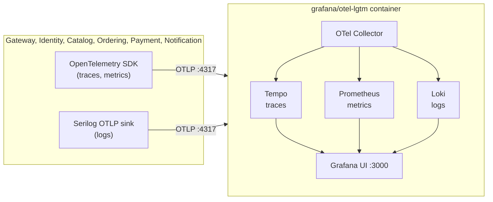
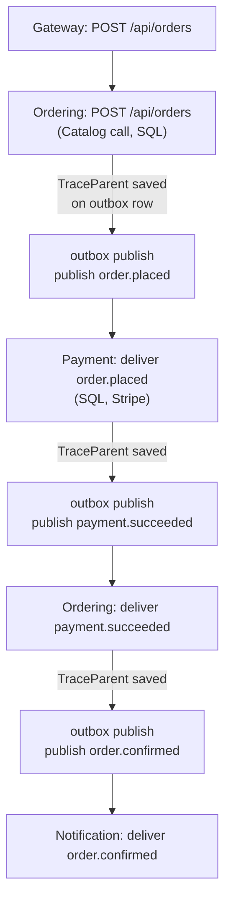

# Observability

Every service sends traces, metrics and logs to one Grafana stack, so a single order can be followed across all services.

## Contents

- [Looking at the data](#looking-at-the-data)
- [What is collected](#what-is-collected)
- [One trace per order](#one-trace-per-order)
- [Setup in code](#setup-in-code)
- [Gotchas](#gotchas)

## Looking at the data

1. Start the stack with `docker compose up -d` (the `lgtm` service).
2. Open http://localhost:3000 and sign in with `admin` / `admin`.
3. In **Explore**, pick a data source:

| Data source | Use it for | Start with |
|---|---|---|
| Tempo | Traces | **Search** tab, `Service Name` = e.g. `Ordering.Api` |
| Loki | Logs | Label `service_name` |
| Prometheus | Metrics | e.g. `aspnetcore_routing_match_attempts_total` |

Log lines carry `trace_id` and `span_id`, so Grafana links a log line to its trace and back.

## What is collected

| Signal | Source | Notes |
|---|---|---|
| Traces | ASP.NET Core, `HttpClient`, Npgsql (so EF Core), RabbitMQ.Client, outbox publish | `/health` is filtered out |
| Metrics | ASP.NET Core, `HttpClient`, .NET runtime, Npgsql | Exported about every 60 seconds |
| Logs | Serilog events | Console and file sinks stay as they were |

Redis calls are not traced.

## One trace per order

The trace context travels in the W3C `traceparent` format: in HTTP headers, in RabbitMQ message headers, and in a column on the outbox row.

- The outbox publishes later from a background poll, which has no link to the original request.
- So each outbox row stores `TraceParent` (`Activity.Current.Id`) when it is written. `OutboxPublisher` restores it as the parent of an `outbox publish` span before publishing.
- Rows written before this column existed have no `TraceParent`. They publish normally and start a new trace.

## Setup in code

| Piece | Where | Does |
|---|---|---|
| `AddShopShopTelemetry("<Svc>.Api")` | `BuildingBlocks.Web/Observability/TelemetryExtensions.cs` | Traces and metrics, exported over OTLP |
| `WriteToOtlp("<Svc>.Api")` | `BuildingBlocks.Web/Observability/SerilogOtlpExtensions.cs` | Adds the Serilog OTLP sink to the `UseSerilog` chain |
| `OutboxTracing` | `BuildingBlocks.Messaging/OutboxTracing.cs` | Captures and restores `TraceParent` |
| `OutboxMessage.TraceParent` | `Ordering.Infrastructure`, `Payment.Infrastructure` | Nullable `varchar(100)` column |

- Each `Program.cs` calls both extensions with the same service name, so logs and traces share one label.
- The exporter endpoint defaults to `http://localhost:4317`. Set the standard `OTEL_EXPORTER_OTLP_ENDPOINT` environment variable to change it. No user secrets are needed.

## Gotchas

- The `Gateway.Api` name must be passed in both calls. A copy-pasted name makes the Gateway show up as another service.
- The source names in `TelemetryExtensions` must match the code that emits spans, including the `"BuildingBlocks.Messaging"` string for `OutboxTracing`. A typo compiles but silently drops those spans.
- The OTLP endpoint must start with `http://` (port 4317 is plain gRPC). A malformed value stops a service at startup.
- The collector keeps data in the `lgtm_data` volume, so data survives restarts.
- The gateway's `X-Correlation-Id` is still created and logged. It is separate from the trace id.
